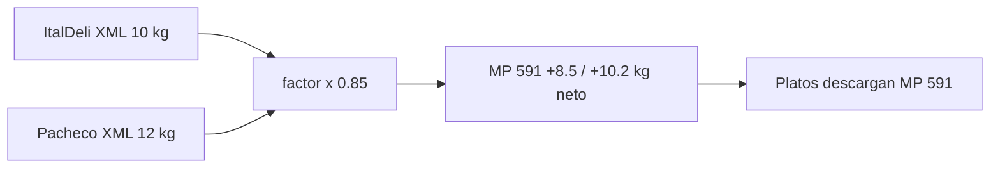

# Estrategia: unificación lomo fino de res

Guía para pasar de **dos MPs de compra** (047 ItalDeli + 552 Pacheco) a **un solo ítem operativo** con **merma de producción del 15%** (sangre, piltra, recorte).

Relacionado: `ESQUEMA_RECETAS_SUBRECETAS.md`, `registrar_produccion_subreceta.py`, `procesar_facturas_drive.py`.

---

## 1. Situación actual

| MP | Nombre | Proveedor | Ítem catálogo | Platos que lo usan |
|----|--------|-----------|---------------|-------------------|
| **047** | LOMO FINO DE RES ITALIANA | ItalDeli (068) | `000339` | Lomo Kuro (180 g), Lomo Saltado (150 g) |
| **552** | LOMO FINO DE RES PIGGIS | Pacheco (006) | `01008009` | Udon Prime (150 g), Drunken (90 g), Bao lomo (90 g), variedades Pad Thai / Tamago / Bibimbap (+100 g) |

**Problemas hoy**

1. Dos stocks, dos costos y dos filas PAR para el mismo insumo físico.
2. Ingresos recientes caen en **BOD-005** (catálogo) pero ventas descargan de **BOD-001**.
3. El desperdicio de depuración (sangre/piltra ~15%) **no está modelado**; el plato consume el peso bruto de compra.
4. Stock 047/552 desalineado → **se corrige con conteo** (pendiente, ver §7).

---

## 2. Modelo objetivo — dos opciones

### Opción A — Merma automática al facturar (**recomendada**)

La factura sigue registrando el peso bruto del XML, pero el **ingreso a inventario** aplica **−15%** automáticamente. No hace falta `PRODUCIR SUB` ni semi intermedio.



| Campo en ENTRADA | Sin merma | Con merma 15% |
|------------------|-----------|---------------|
| Peso factura XML | 10 000 g | 10 000 g (referencia) |
| `cantidad_mov` | 10 000 g | **8 500 g** |
| `costo_total` | $220 | **$220** (igual, lo pagado) |
| `costo_unitario` | $0.022/g | **$0.02588/g** (220 ÷ 8500) |

Fórmula en `registrar_entrada_inventario`:

```text
cantidad_mov = cantidad_xml × factor_conversion × (1 − merma_pct_ingreso)
costo_unitario = costo_efectivo / (factor_conversion × (1 − merma_pct_ingreso))
costo_total    = precio_total_sin_impuesto   # sin cambio
```

En `BD_ITEMS_PROV` para ItalDeli y Pacheco: `merma_pct_ingreso = 0.15`.

**Ventajas:** operación simple; cocina no registra producción; platos siguen consumiendo MP directo (solo cambia 047/552 → 591).

**Limitación:** el 15% es un **promedio fijo** por factura, no el recorte real de cada depuración. Si un lote pierde más o menos, el conteo físico corrige.

---

### Opción B — Semi SUB-073 (merma en producción)

Solo si más adelante quieren trazabilidad bruto/neto por lote o merma variable por batch.

| Capa | Qué es | Movimiento |
|------|--------|------------|
| **MP 591** | Lomo **bruto** (peso factura) | ENTRADA 100% del XML |
| **SUB-073** | Lomo **depurado** | `PRODUCIR SUB 073` (10 kg bruto → 8,5 kg neto) |
| **Plato** | Porción | Descargo de SUB-073 |

Ver §4 (referencia) si se activa esta opción.

**Decisión actual:** implementar **Opción A** salvo que operación pida control por lote.

---

## 3. MP unificado de compra

### 3.1 Código propuesto

| Campo | Valor |
|-------|-------|
| `cod_mp_sistema` | **591** (nuevo; evita mezclar historial 047/552) |
| `nombre_mp` | **LOMO FINO DE RES** |
| `unidad_base` | `gr` |
| `cod_bodega_destino` (facturas) | `BOD-005` (externa; traslado a cocina según operación) |

> Alternativa: reutilizar **047** renombrado. Se descarta para staging porque el historial de 047 y 552 en `mov_inventario` seguiría separado y confundiría reportes.

### 3.2 Catálogo proveedores (`BD_ITEMS_PROV`)

| Proveedor | Ítem | Cambio |
|-----------|------|--------|
| ItalDeli 068 | `000339` LOMO FINO DE RES KG | `cod_mp_sistema` → **591** |
| Pacheco 006 | `01008009` LOMO FINO EMP. AL VACIO | `cod_mp_sistema` → **591** |
| 047 / 552 | — | `activo=NO` en ítems y filas maestro cuando termine migración |

**Costo:** `recalcular_stock_sheets` ya promedia ENTRADAs por `(MP, bodega)`; con un solo MP el costo ponderado ItalDeli + Pacheco queda automático.

### 3.3 MPs legacy

| MP | Tratamiento |
|----|-------------|
| 047, 552 | Mantener en `mov_inventario` (historial). Dejar de usar en catálogo y recetas. |
| Stock abierto | Resolver en **conteo + ajuste** hacia 591 o saldo cero en legacy (§7). |

---

## 4. Merma 15% en producción (SUB-073)

### 4.1 Definición operativa

- **Peso bruto** = kg que entra en inventario al facturar (MP 591).
- **Peso neto depurado** = bruto × **0,85** (15% sangre, piltra, recorte).
- La merma **no** se registra en la factura; se aplica al **producir** el semi.

### 4.2 Cómo modelarlo en `BD_SUBRECETAS`

El motor de producción calcula:

`consumo_MP = cantidad_detalle × factor × (1 + merma_pct)`  
`factor = cantidad_producida / rendimiento_estandar`

**Forma recomendada (ratio bruto/neto, sin `merma_pct`):**

| Campo SUB-073 | Valor | Nota |
|---------------|-------|------|
| `nombre_subreceta` | lomo fino depurado | |
| `rendimiento_estandar` | **8500** | gr netos por lote estándar |
| `unidad` | gr | |
| Detalle MP 591 | **10000** gr | gr brutos por lote de 8500 g netos |
| `merma_pct` (detalle) | **0** | la pérdida ya está en 10000→8500 (15%) |

Verificación: producir 8500 g netos → `factor=1` → consume 10000 g bruto → salida 8500 g → **15% merma** ✓

**Lote estándar sugerido:** 10 kg bruto → 8,5 kg neto (tamaño razonable para una depuración en cocina). Ajustable según práctica real.

### 4.3 Comando operativo

```text
PRODUCIR SUB 073 BOD-001
```

- Baja MP **591** de la bodega indicada.
- Entra stock **SUB-073** en la misma bodega.
- Jacky / cocina ejecuta esto al depurar lomo recibido de externa.

### 4.4 Subrecetas hijas por plato (fase 2, opcional)

Si más adelante hay **preparaciones distintas** (marinado kuro, salteado, corte bao), se pueden crear:

| SUB | Uso | Consume |
|-----|-----|---------|
| 074 | lomo kuro listo | SUB-073 + condimentos |
| 075 | lomo saltado listo | SUB-073 + … |
| 076 | lomo bao / udon | SUB-073 + … |

**Fase 1:** platos consumen **SUB-073** directamente con los gramajes actuales del plato. No es obligatorio crear 074–076 hasta que exista receta de semi distinta a “depurar”.

---

## 5. Migración de carta (`BD_RECETAS_DETALLE`) — Opción A

Los platos pasan de 047/552 al **MP 591** (no a SUB). Mismos gramajes; la merma ya está en el ingreso.

| cod_receta | Variedad | Quitar MP | Poner MP | Cantidad |
|------------|----------|-----------|----------|----------|
| 146 | — | 047 | **591** | 180 gr |
| 136 | — | 047 | **591** | 150 gr |
| 6 | — | 552 | **591** | 150 gr |
| 7 | — | 552 | **591** | 90 gr |
| 5 | BEEF CRUNCH / LOMO PONZU | 552 | **591** | 90 gr |
| 8, 11, 12 | LOMO | 552 | **591** | 100 gr |

`merma_pct` en plato: **0** (ya aplicada al facturar).

### 5.1 Opción B (solo si usan SUB-073)

Matriz original: platos consumen SUB-073 en lugar de MP 591 (ver versión anterior en git).

---

1. Cargar cambios en `STAGING_RECETAS` / `STAGING_SUB_*`.
2. Mary aprueba → `promover_staging_recetas.py --produccion`.
3. Validar costos: `calcular_costo_subrecetas.py --produccion` y `calcular_costo_platos.py`.

### 5.3 Descargo de ventas

Tras la migración, `descargo_inventario` baja **SUB-073**, no 047/552. Requiere stock de semi producido (o alertas si cocina vende sin haber producido).

---

## 6. Plan de implementación (Opción A)

| Fase | Qué |
|------|-----|
| **1** | Columna `merma_pct_ingreso` en `BD_ITEMS_PROV` + lógica en `procesar_facturas_drive.py` |
| **2** | MP **591** + ítems ItalDeli/Pacheco → 591 con `merma_pct_ingreso=0.15` |
| **3** | Migrar 9 líneas receta → MP 591 |
| **4** | Desactivar 047/552 en catálogo |
| **5** | Conteo: abrir saldo 591 (P1–P3 §7) |

**Código (~15 líneas)** en `registrar_entrada_inventario`:

```python
merma_ing = _parse_merma(item_prov.get("merma_pct_ingreso"))  # 0.15
neto = 1.0 - merma_ing if 0 < merma_ing < 1 else 1.0
cantidad_base = item_factura["cantidad"] * factor * neto
costo_u = item_factura["costo_efectivo"] / (factor * neto)
# observaciones += f" | bruto_xml={...}g merma_ingreso={merma_ing:.0%}"
```

**Atajo sin código (no recomendado):** multiplicar `factor_conversion × 0.85` en catálogo — oscurece auditoría y no documenta la merma en observaciones.

---

## 6b. Plan Opción B (SUB-073)

| Fase | Qué |
|------|-----|
| 1 | MP 591 + SUB-073 en staging |
| 2 | Catálogo → 591 (sin merma en ingreso) |
| 3 | Recetas → SUB-073 |
| 4 | Capacitar `PRODUCIR SUB 073` |

---

## 7. Pendientes (acordado)

| # | Tarea | Cuándo | Notas |
|---|-------|--------|-------|
| P1 | **Corregir stock 047/552** vía conteo físico | Antes o en paralelo con go-live 591 | No bloquea diseño; sí bloquea cierre de legacy |
| P2 | Ajuste / apertura saldo inicial **MP 591** en conteo | Mismo conteo | Sumar físico 047+552 como un solo ítem “lomo fino res” |
| P3 | Cerrar filas 047/552 en `BD_MP_SISTEMA` a saldo 0 | Post conteo | Tras validar que 591 refleja realidad |
| P4 | Subrecetas hijas 074–076 (kuro / saltado / bao) | Solo si hay prep adicional documentada | Opcional |

---

## 8. Impacto en código (checklist dev)

- [ ] `BD_ITEMS_PROV`: ítems `000339`, `01008009` → MP 591
- [ ] `setup_staging_subrecetas.py` / promover: SUB-073
- [ ] `BD_MP_SISTEMA`: filas 591 + SUB-073 por bodega
- [ ] `BD_RECETAS_DETALLE`: 9 líneas §5.1
- [ ] `configurar_variedades_platos.py`: `EXTRAS_MP["LOMO"]` → SUB-073
- [ ] `calcular_par_levels` / consumo: incluir SUB-073 vía explosión a MP 591
- [ ] `procesar_facturas_drive`: sin cambio de lógica si catálogo apunta a 591
- [ ] Tests: producción SUB-073 consume 10000 g MP por 8500 g salida

---

## 9. Ejemplo numérico (una semana)

| Evento | MP 591 bruto | SUB-073 neto |
|--------|--------------|--------------|
| Factura Pacheco 12 kg | +12 000 g | — |
| Factura ItalDeli 15 kg | +15 000 g | — |
| `PRODUCIR SUB 073` × 2 lotes (17 kg neto) | −20 000 g | +17 000 g |
| Ventas Udon + Bao (~2 kg neto) | — | −2 000 g |

Saldo bruto: 27 000 − 20 000 = **7 000 g** en externa/cocina.  
Saldo neto: 17 000 − 2 000 = **15 000 g** listos en cocina.

La diferencia entre bruto consumido (20 kg) y neto producido (17 kg) = **3 kg merma** (15%), visible en el libro como MP bajado − semi entrado.

---

## 10. Decisiones antes de implementar

1. ¿Confirmas **Opción A** (merma 15% automática al facturar)?
2. ¿Código **591** para el MP unificado?
3. ¿`merma_pct_ingreso = 0.15` en ambos ítems de proveedor?

Con esas tres respuestas se implementa en el siguiente paso.
