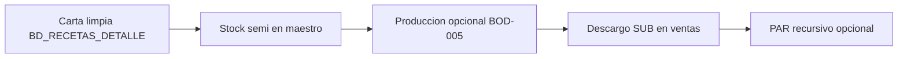

# Plan: descargo de inventario por subreceta (SUB)

Documento de diseño para la **fase H** del roadmap de subrecetas. Hoy el descargo diario (`descargo_inventario.py`) solo procesa líneas **MP** (`filtrar_solo_mp`).

Relacionado: `ENTIDADES_Y_FLUJOS.md` §11, `ESQUEMA_RECETAS_SUBRECETAS.md` §8, `bodegas_config.py`.

---

## 1. Objetivo

Al vender un plato con líneas **SUB** en `BD_RECETAS_DETALLE`:

1. **No** volver a descontar los MPs que ya están dentro del semi (evitar doble descargo).
2. Descontar **stock del semi** en la `cod_bodega` de la línea (cocina o barra).
3. Valorizar la salida con `costo_unitario_estandar` de `BD_SUBRECETAS` (o costo ref del pseudo-MP).

Mientras no exista stock de semis, el descargo SUB puede ir detrás de **conteo físico** + **producción** + **pseudo-MP en maestro**.

---

## 2. Estado actual

| Componente | Comportamiento |
|------------|----------------|
| `get_ingredientes` | Carga MP y SUB desde `BD_RECETAS_DETALLE` |
| `procesar_descargo` | `filtrar_solo_mp(...)` → ignora SUB |
| `calcular_costo_recetas` | Sí usa SUB para costo teórico |
| `consumo_ingrediente_recetas` (WA) | Explota solo MPs en receta (misma limitación) |
| Stock semi | No existe fila en `BD_MP_SISTEMA` por subreceta |

**Consecuencia:** Migrar plato de MP → SUB **reduce** descargo automático hasta activar este plan (aceptable si el conteo físico repone la foto).

---

## 3. Prerrequisitos (orden)



| # | Entregable | Notas |
|---|------------|--------|
| 1 | Carta con líneas SUB correctas | Staging v2 + promover; quitar MPs duplicados |
| 2 | **Pseudo-MP** por subreceta activa | Ver §4 |
| 3 | Conteo físico por bodega | Cuadra stock MP y semi |
| 4 | Producción de lote (fase G) | MPs bajan al producir; semi entra en BOD-005 |
| 5 | Flag / config activar descargo SUB | `DESCARGO_SUBRECETAS=1` |

---

## 4. Stock del semi: pseudo-MP (recomendado)

Por cada `cod_subreceta` activa en `BD_SUBRECETAS`:

| Campo maestro | Valor propuesto |
|---------------|-----------------|
| `cod_mp_sistema` | `SUB-{cod}` ej. `SUB-006` o reutilizar `006` si el maestro lo permite |
| `nombre_mp` | Nombre del semi |
| `unidad_base` | `gr` / `ml` / `uni` (igual cabecera subreceta) |
| `cod_bodega` | Filas en BOD-001, BOD-002 (y 005 si aplica) |
| `costo_unitario_ref` | Copiar `costo_unitario_estandar` tras `calcular_costo_subrecetas` |
| `stock_actual` | Desde `mov_inventario` + conteo |

**Ventajas:** Reutiliza `recalcular_stock_sheets`, `trasladar_mp`, conteo cíclico, valorizado WA.

**Script nuevo (fase 4):** `sync_stock_subrecetas_maestro.py` — crea/actualiza filas pseudo-MP y sincroniza costo ref.

---

## 5. Cambios en `descargo_inventario.py`

### 5.1 Modo dual (config)

```python
# .env
DESCARGO_SUBRECETAS=0   # default: solo MP (comportamiento actual)
DESCARGO_SUBRECETAS=1   # MP + SUB (semis)
```

### 5.2 Flujo por venta

```
ingredientes = get_ingredientes(cod_receta, variedad)

if DESCARGO_SUBRECETAS:
    lineas_mp  = filtrar_solo_mp(ingredientes)
    lineas_sub = filtrar_solo_subreceta(ingredientes)
else:
    lineas_mp  = filtrar_solo_mp(ingredientes)
    lineas_sub = []
```

### 5.3 Línea MP (sin cambio)

- `consumo = cantidad × cantidad_vendida × (1+merma) × pct`
- `SALIDA_VENTA` de `cod_mp_sistema` en `cod_bodega` receta
- Costo: `costo_unitario_ref` del MP

### 5.4 Línea SUB (nuevo)

| Paso | Acción |
|------|--------|
| 1 | Resolver `cod_mp_stock = pseudo_mp(cod_subreceta)` |
| 2 | `consumo = cantidad × cantidad_vendida × pct` (merma en semi, no en plato salvo columna) |
| 3 | Validar `cod_bodega` ∈ `BODEGAS_DESCARGO_VENTA` |
| 4 | `SALIDA_VENTA` con `cod_mp_sistema = cod_mp_stock`, `observaciones` con `SUB:{cod}` y `cod_receta` |
| 5 | Costo unitario: `costo_unitario_estandar` de BD_SUBRECETAS (o ref pseudo-MP) |

**No** explotar SUB→MP en venta (eso es producción o PAR).

### 5.5 Observaciones movimiento

```
Descargo venta SUB 006 pan bao | plato 017 | var= | bod=BOD-001 | consumo=2 uni
```

### 5.6 Platos solo SUB sin MP

Si tras migración un plato queda solo con líneas SUB, con `DESCARGO_SUBRECETAS=1` debe generar movimientos; con `0` marcaría `sin_receta` — documentar en logs.

---

## 6. Producción (fase G, previa al descargo fiable)

Tabla Supabase **`produccion_subreceta`** (propuesta):

| Campo | Tipo | Uso |
|-------|------|-----|
| `id` | uuid | PK |
| `cod_subreceta` | text | Semi producido |
| `cod_bodega_produccion` | text | Default BOD-005 |
| `cantidad_producida` | numeric | Lote real (unidad cabecera) |
| `rendimiento_estandar_usado` | numeric | Del maestro |
| `factor` | numeric | `cantidad_producida / rendimiento` |
| `fecha` | timestamptz | |
| `registrado_por` | text | Jacky / AGENTE / WA |

**Movimientos generados:**

1. Por cada línea detalle escalada: `SALIDA` MP en `cod_bodega` línea × factor.
2. `ENTRADA` pseudo-MP semi en `cod_bodega_produccion` × `cantidad_producida`.

CLI / WA: `registrar_produccion_subreceta.py` (pendiente implementar).

---

## 7. PAR y consumo teórico (fase opcional)

`calcular_par_levels.py` hoy suma solo MPs en `BD_RECETAS_DETALLE`.

**Mejora:** función `explotar_subreceta_a_mp(cod_sub, cantidad, factor=1)` recursiva con ciclo detectado → sumar MPs para planeación sin movimientos.

Prioridad **después** del descargo SUB en ventas.

---

## 8. WhatsApp y auditoría

| Tool | Cambio |
|------|--------|
| `consumo_ingrediente_recetas` | Opción `incluir_subrecetas=1` que explote SUB→MP para comparar con consumo “real” |
| Nuevo | `registrar_produccion_subreceta` (cuando exista backend) |

Auditoría: script `auditar_platos_sin_descargo_sub.py` — platos con líneas SUB y flag descargo apagado.

---

## 9. Riesgos y mitigaciones

| Riesgo | Mitigación |
|--------|------------|
| Doble descargo MP + SUB mismo ingrediente | Regla carta: MPs duplicados fuera; auditoría pre-descargo |
| Stock semi negativo sin producción | Conteo + producción antes de `DESCARGO_SUBRECETAS=1` |
| Unidad distinta (uni vs gr) | Respetar `unidad_base` en línea plato y cabecera SUB |
| Pseudo-MP colisiona con MP real | Prefijo `SUB-` obligatorio |

---

## 10. Plan de implementación por sprints

### Sprint 1 — Fundamentos (sin tocar descargo ventas)

- [x] Staging recetas v2 + subrecetas (`setup_staging_*`, `promover_staging_*`)
- [x] `sync_stock_subrecetas_maestro.py` (dry-run + producción)
- [x] Mapping SUB→pseudo-MP: `pseudo_mp_cod()` en `descargo_subreceta.py` (prefijo `SUB-`)

### Sprint 2 — Descargo SUB

- [x] `descargo_subreceta.py` + `test_descargo_subreceta.py`
- [x] Integrar en `descargo_inventario.py` tras flag `DESCARGO_SUBRECETAS`
- [x] Logs + resumen `salidas_mp` / `salidas_sub`

### Sprint 3 — Producción

- [ ] SQL `produccion_subreceta`
- [ ] `registrar_produccion_subreceta.py`
- [ ] Tool WA (opcional)

### Sprint 4 — Planeación

- [ ] PAR recursivo SUB→MP
- [ ] Actualizar `consumo_ingrediente_recetas`

---

## 11. Criterios de aceptación (descargo SUB activo)

1. Venta de plato con línea SUB `006` × 2 uni genera `SALIDA_VENTA` del pseudo-MP en bodega receta.
2. Venta del mismo plato **no** genera salida de MPs internos del pan bao.
3. Con flag `0`, comportamiento idéntico al actual.
4. `recalcular_stock_sheets` refleja salidas de pseudo-MP.
5. Costo de salida coherente con `BD_SUBRECETAS.costo_unitario_estandar` (± redondeo).

---

*Última actualización: alineado con scripts staging 2026-05.*
