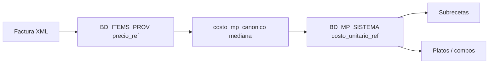

# Reglas de costos MP — evitar errores recurrentes

Documento de referencia para compras, catálogo (`BD_ITEMS_PROV`) y costos teóricos (subrecetas / platos).

**Código fuente de verdad:** `procesar_facturas_drive.py` → `costo_mp_canonico.py` → `numeros_sheets.precio_ref_a_unidad_base` → `sync_costos_mp_desde_items_prov.py` → `calcular_costo_subrecetas.py` / `calcular_costo_recetas.py`.

---

## 1. Contrato único (memorizar)

| Campo | Significado | Ejemplo |
|-------|-------------|---------|
| `unidad_compra` | Cómo factura el proveedor **en el XML** | `pack`, `caja`, `botella`, `kg` |
| `factor_conversion` | Cuántas **unidad_base** trae **una** unidad de compra | Gaseosa caja 24 → `24` (uni). Botella 750 ml → `750` (ml). Combo 12+1 → `13` (botellas), no solo 750. |
| `unidad_base_sistema` | Unidad del MP en maestro | `gr`, `ml`, `uni` |
| `precio_unitario_xml` | Precio **tal cual** en la factura (por unidad_compra) | Pack Fanta 6,68 USD |
| `precio_ref` | **USD por unidad_base** (ya convertido) | 6,68 ÷ 24 = **0,278** USD/botella |

**Fórmula al cargar factura** (`_precio_ref_unidad_base`):

```text
precio_ref = costo_efectivo ÷ factor_conversion
```

**Fórmula en recetas** (no vuelve a dividir por factor):

```text
costo_línea = cantidad_receta × costo_unitario_ref × (1 + merma%) × pct_aplicación
```

`costo_unitario_ref` sale de `BD_MP_SISTEMA` (mediana robusta de ítems prov activos, vía `precio_ref_a_unidad_base`).

---

## 2. Cadena completa (dónde se rompe)



Los errores **no** están en la receta (solo multiplica cantidades). Están en:

1. **Catálogo:** `factor_conversion` o `unidad_compra` mal definidos.
2. **Lectura:** tratar `precio_ref` como precio de bulto y dividir otra vez (`precio_ref_a_unidad_base`).
3. **Varias filas** mismo MP con conversiones incompatibles (mediana elige la incorrecta).

---

## 3. Tres errores que ya ocurrieron (y cómo evitarlos)

### A) Pack compuesto (MP 302 — espumante 12+1)

**Síntoma:** Spritz ~15 USD; debería ~1–2 USD solo de espumante.

**Causa:** Factura combo con `costo_efectivo` = precio del **pack** (87,64 o 107,25) y `factor` = **750** (ml de una botella). El sistema hizo:

```text
87,64 ÷ 750 = 0,117 USD/ml   ← MAL (falta ÷ 13 botellas)
```

**Correcto:**

```text
107,25 ÷ 13 botellas = 8,25 USD/botella
8,25 ÷ 750 ml = 0,011 USD/ml
```

**Regla:**

| Tipo de línea en factura | `unidad_compra` | `factor_conversion` |
|--------------------------|-----------------|---------------------|
| Botella suelta 750 ml | `botella` | `750` (ml) |
| Pack 12+1 (13 uni) | `pack` o `caja` | **`13`** (botellas), no 750 |
| Si el MP se mide en ml y quieres un solo factor | `pack` | **`13 × 750 = 9750`** (ml totales del pack) |

**Checklist:**

- [ ] Si la descripción dice `12+1`, `x24`, `caja`, el factor debe ser el **número de unidades del pack**, no el volumen de una unidad.
- [ ] Tras la primera factura combo, revisar `precio_ref`: para vinos/espumantes en ml, suele estar entre **0,008–0,02** USD/ml, no **0,10+**.
- [ ] Preferir actualizar precio desde líneas de **botella suelta** o corregir manualmente la fila combo (o desactivarla `activo=NO`).

---

### B) Gaseosas / latas (MP 262, 263)

**Síntoma:** Combos y gaseosa 21 a ~0,02 USD; catálogo muestra ~0,24–0,28.

**Causa:** `precio_ref` **ya** es USD/botella (factura hizo pack ÷ 12/24). El motor volvió a dividir:

```text
0,242 ÷ 12 = 0,020   ← segunda división (MAL)
```

**Regla:**

- Tras `procesar_facturas`, `precio_ref` para `unidad_base = uni` y pack 12/24 debe ser **≈ precio_pack ÷ N** (0,15–0,35 USD/uni típico).
- `precio_ref_a_unidad_base` **no** debe dividir otra vez si `factor ∈ {12,24,…}` y `precio × factor` ≈ total del pack (2–80 USD).
- En recetas: **1 uni** = **1 botella**; el costo es el `precio_ref` (o mediana), no `precio_ref ÷ 12`.

**Checklist:**

- [ ] `precio_ref` coherente con `precio_unitario_xml ÷ factor` en la misma fila.
- [ ] Tras cambio de código: `python sync_costos_mp_desde_items_prov.py --produccion --mp 262 263` y recetas.

---

### C) Mismo MP, dos conversiones (MP 127 — salmón)

**Síntoma:** Plato salmón caro; una fila porción bien, otra steak con `precio_ref` alto.

**Causa:** Dos ítems prov → misma MP 127 con factores distintos (4536 vs 453). La **mediana** puede quedarse con el valor alto si `precio_ref` del steak sigue en **0,045** en lugar de **9,6 ÷ 453 ≈ 0,021**.

**Regla:**

- [ ] **Un MP = una lógica de conversión** (misma `unidad_base`, factor coherente con cómo compras).
- [ ] Si hay dos presentaciones (porción vs steak), ambas deben dar **USD/gr similares**; si no, revisar factor o desactivar la fila duplicada.
- [ ] Verificar: `precio_ref × factor ≈ precio_unitario_xml` (tolerancia ~5%).

**Checklist post-corrección:**

```bash
python sync_costos_mp_desde_items_prov.py --produccion --mp 127
python calcular_costo_recetas.py --produccion
```

---

## 4. Tabla rápida por tipo de producto

| Tipo | unidad_base | factor_conversion | precio_ref esperado |
|------|-------------|-------------------|---------------------|
| Granel kg comprado en kg | gr | **1000** | USD/gr (ej. 0,005) |
| Botella vino/espumante 750 ml | ml | **750** | USD/ml (ej. 0,01–0,15) |
| Pack botellas N×750 ml | ml o botella | **N** o **N×750** | No usar solo 750 con precio del pack |
| Gaseosa caja 12 / 24 | uni | **12** o **24** | USD/botella (~0,2–0,3) |
| Proteína por pieza (steak) | gr | gramos **reales por pieza** | USD/gr alineado con XML |

---

## 5. Al dar de alta o promover ítem (`BD_ITEMS_PROV`)

1. Definir **`unidad_compra`** = lo que dice la factura.
2. Definir **`factor_conversion`** = unidades de `unidad_base` **por una compra**.
3. No copiar el factor de otro ítem del mismo proveedor sin revisar descripción XML.
4. Si el ítem es **pack promocional** (12+1, 2×1), documentar en descripción y usar factor del **pack completo**.
5. Tras la primera factura, abrir la fila y comprobar:
   - `precio_unitario_xml` = precio factura
   - `precio_ref` = `costo_efectivo ÷ factor` (mental o calculadora)
6. Si el mismo `cod_mp_sistema` ya existe con otro factor, **unificar criterio** antes de seguir comprando.

---

## 6. Después de procesar facturas (rutina)

```bash
# 1. Precios desde XML (si aplica)
python procesar_facturas_drive.py --solo-precios-desde-xml

# 2. Sincronizar MPs tocados o todo el maestro
python sync_costos_mp_desde_items_prov.py --produccion

# 3. Cadena teórica
python calcular_costo_subrecetas.py --produccion
python calcular_costo_recetas.py --produccion
```

**Auditoría preventiva** (detecta packs mal leídos, doble división, MPs inflados):

```bash
python diagnostico_costos_completo.py
python auditar_costos_recetas.py
```

Revisar CSV / avisos con MPs en combos, bebidas, proteínas caras.

---

## 7. Señales de alerta en hoja o logs

| Señal | Probable causa |
|-------|----------------|
| `precio_ref` vino/ml **> 0,08** pero factura ~8 USD/botella | Pack dividido solo entre ml, no entre botellas |
| Gaseosa `precio_ref` ~0,24 pero receta ~0,02 | Doble división (revisar sync y `precio_ref_a_unidad_base`) |
| Dos filas mismo MP, `precio_ref` ×10 de diferencia | Factores distintos; corregir o desactivar una fila |
| `ALERTA precio` en log de facturas | Variación brusca; validar factor antes de aceptar |
| Spritz / chandon muy bajo o muy alto | MP 212/302 mal convertido o cantidad ml en receta |

---

## 8. Responsabilidades por capa

| Capa | Quién la cuida | Qué no hacer |
|------|----------------|--------------|
| Catálogo `BD_ITEMS_PROV` | Compras / admin | Factor 750 en un pack 12+1 |
| `procesar_facturas_drive` | Automático | Confía en factor del catálogo; no adivina packs |
| `precio_ref_a_unidad_base` | Código | No dividir `precio_ref` ya unitario (gaseosas, whiskies ml) |
| `BD_MP_SISTEMA` | Sync + movimientos | No editar a mano sin pasar por ítems prov |
| Recetas | Operación / chef | Cantidades en `unidad_base`; no dividir costos ahí |

---

## 9. Corrección del MP 302 (pendiente de catálogo)

Hasta corregir la fila COLEMUN combo:

- Opción A: `factor_conversion = 13`, `unidad_compra = pack`, reprocesar o fijar `precio_ref ≈ 0,011` USD/ml.
- Opción B: `activo=NO` en ítem combo; dejar solo botella suelta (factor 750).
- Opción C: `factor_conversion = 9750` (13×750 ml) si se mantiene precio del pack en XML.

Luego: `sync_costos_mp_desde_items_prov.py --produccion --mp 302` y recetas.

---

*Última actualización: mayo 2026 — casos MP 302, 127, 262/263.*
